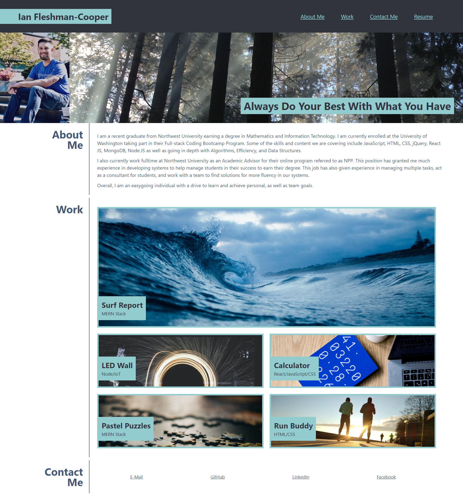

# My-Portfolio

## Description

My personal portfolio features my skillset utulizing HTML and CSS. Within my portfolio are links to some of my other works, as well as, links to my resume and contact information. 

## Table of Contents

* [License](#license)
* [Contributing](#contributing)
* [Screenshot](#screenshot)
* [Link](#link)
* [Questions](#questions)

## License

MIT

## Contributing

Ianaac27

## Screenshot

Here is a mock of my portfolio.

## Link

Take a look at the live version [here.][https://ianaac27.github.io/My-Portfolio/]

## Questions

If you have any questions, please refer to my contact information below.

[GitHub: Ianaac27](https://www.github.com/Ianaac27)

Email: ian.fleshmancooper@gmail.com
